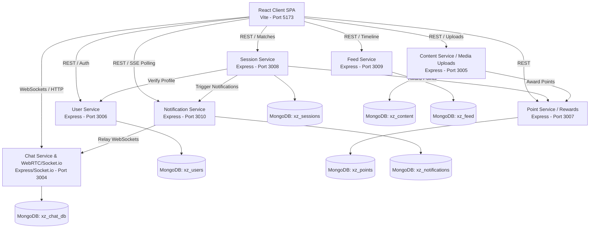

# Digital Roots (XZ Ancestral Network) — Comprehensive System Documentation & Defense Guide

Welcome to the complete documentation of the **Digital Roots (XZ Ancestral Network)** application. This document is designed to provide a comprehensive, deep-dive understanding of the entire codebase, software architecture, data flows, and system designs. 

Whether you are preparing to defend this project before an academic panel, perform a code review, or continue developing features, this guide will allow you to understand every aspect of the project as if you wrote the entire codebase from scratch.

---

## 1. Project Vision & Core Problem
Modern technology has created a digital divide: younger generations are tech-savvy but risk losing touch with ancestral traditions, regional dialects, and oral folklore. Conversely, older generations hold rich cultural wisdom but often struggle to access or navigate modern digital interfaces.

**Digital Roots** bridges this intergenerational gap. It is a specialized microservices-based social and mentorship network designed to:
* **Facilitate Intergenerational Mentorship**: Pair Youth (to teach digital literacy) with Elders (to teach cultural heritage, languages, and regional folklore).
* **Archive Oral History**: Enable Youth to conduct live recorded interviews with Elders, preserving their memories as audio archives.
* **Reward Community Contribution**: Uses a gamified reward system (**Legacy Credits** and badges) to incentivize active storytelling, interviewing, and digital learning.

---

## 2. System Architecture & Microservices Layout

Digital Roots is built using a modern **Microservices Architecture**. Instead of one monolithic application, the platform is split into independent services, each responsible for a single business capability. 

### High-Level Service Architecture



### Microservices Port Registry

| Service Name | Port | Database Name | Description |
| :--- | :--- | :--- | :--- |
| **Vite Frontend Client** | `5173` | *Browser State* | Single Page React application (TailwindCSS, Lucide icons, Socket.io client). |
| **xz-user-service** | `3006` | `xz_users` | Handles user authentication, profile edits, registration, and rewards storage. |
| **xz-session-service** | `3008` | `xz_sessions` | Manages mentoring connections (pairings), intergenerational matches, and interviews. |
| **xz-chat-service** | `3004` | `xz_chat_db` | Orchestrates real-time chat, Socket.io connections, typing indicators, and WebRTC call signaling. |
| **xz-content-service** | `3005` | `xz_content` | Manages memory uploads (images, audio, videos) and Whisper transcription. |
| **xz-feed-service** | `3009` | `xz_feed` | Generates the timeline feed of approved cultural stories. |
| **xz-point-service** | `3007` | `xz_points` | Core engine for points evaluation (Legacy Credits) and badge allocations. |
| **xz-notification-service** | `3010` | `xz_notifications` | Holds notification registries and drives notifications delivery. |

---

## 3. Deep Dive: Microservice Implementations

### A. User Service (`xz-user-service` - Port 3006)
The User Service handles user registrations, logins, profile updates, and stores points/badges balances.
* **Authentication Method**: JWT (JSON Web Tokens). Upon successful login, the server issues a JWT token containing `id`, `email`, `role`, and `name`, signed with a shared key (`xz_jwt_secret_shared_2026_key`).
* **Roles**: 
  * `Youth`: Can act as Archivists and request/provide digital literacy mentoring.
  * `Elder`: Can act as Subjects (narrators) and request/provide cultural heritage mentoring.
  * `Admin`: Manages content moderation. Restricted from chat-thread generation and mentoring connections.
* **ETag Mitigation**: `app.set('etag', false)` is configured to prevent browsers from responding with `304 Not Modified`. This guarantees the frontend receives clean `200 OK` status checks on session recovery.

### B. Session Service (`xz-session-service` - Port 3008)
Controls the matching suggestions algorithm and tracks active pairings and scheduled oral history interview sessions.
* **The Intergenerational Matching Algorithm**: Matches are requested via `GET /api/sessions/mentoring/matches?userId=...&role=...`. It scores compatibility dynamically:
  * **Role Check**: Limits recommendations strictly to opposite roles (Elders matched with Youth, and vice-versa).
  * **Languages (+30% per match)**: Points are added for shared spoken languages (e.g. English, French).
  * **Community Origin (+25% match)**: Added if users belong to the same community origin (e.g. "Sawa Community", "Coastal Origin").
  * **Shared Interests (+15% per match)**: Points are added for overlapping content preferences (e.g., Tech, Oral History, Health).
  * **Maximum Cap**: Scores are capped at `100%` and sorted in descending order of compatibility.
* **Mentorship Constraints**: Users are restricted to a **single active or requested partnership** at a time with the same person to prevent database clutter.
* **Authorization Checks**: The deletion endpoint (`DELETE /api/sessions/mentoring/:pairingId`) checks that the initiator matches either the `mentorId` or `menteeId` of the record, preventing spoofing.

### C. Chat Service (`xz-chat-service` - Port 3004)
Operates the primary communication gateway, utilizing **Socket.io** for WebSockets and **WebRTC** signaling for call sessions.
* **WebSocket Presence (Online Status)**: The client connects to the WebSocket server once upon login. The socket maps the user's connection state to a Redis session or memory-pool. When active, it emits `presence-update` to all connected clients.
* **WebSocket Relays (Real-time Notifications)**: To avoid chat service users polling the database for notifications, an internal route `/api/chat/internal/notifications` is exposed. When another service (like the Notification Service) creates a notification, it POSTs to this internal route, which then uses the existing WebSocket server instance to emit `new-notification` directly to the client socket.
* **WebRTC Signaling**: WebRTC calls require a handshake. The Chat Service acts as the signaling channel, routing `call-user`, `make-answer`, `ice-candidate`, and `end-call` events between the caller and the receiver.

### D. Content Service (`xz-content-service` - Port 3005)
Manages file uploads to a local folder and supports integration with Cloudinary and OpenAI Whisper for transcription.
* **File Categories & Upload Limits**:
  * `Images`: Maximum 10MB (handles avatar uploads, story visuals).
  * `Audios`: Maximum 25MB (handles voice notes, oral history interviews).
  * `Videos`: Maximum 100MB.
* **Multer Configuration**: Files are uploaded to storage using `multer.memoryStorage()`, validated by MIME-type categories, and written to disk safely.

### E. Notification Service (`xz-notification-service` - Port 3010)
Stores persistent notifications in MongoDB (`xz_notifications`).
* **Real-time Delivery**: Communicates directly with the Chat Service via REST API to push notifications instantly down the active WebSocket connection.
* **Auto-Clear on Message Read**: When a user reads a chat thread, the client triggers message clearing. The chat service then issues a DELETE request to `DELETE /api/notifications/user/:userId/reference/:referenceId`, removing chat-related notifications from the database.

---

## 4. Key Workflows Explained (Step-by-Step Code Flows)

### Workflow 1: User Login & Session Recovery
1. The user inputs their email and password in `Login.tsx`.
2. The client submits a POST request to `${USER_SERVICE_URL}/api/users/login`.
3. The server validates the credentials against MongoDB using `bcrypt.compare()`.
4. If valid, the server signs a JWT token containing user details and returns it.
5. The frontend saves the token to **`sessionStorage`** (not `localStorage`). 
   * *Why?* This ensures that if the page is refreshed, the session is preserved, but closing the tab or browser automatically logs the user out, fulfilling secure transient session-only requirements.

---

### Workflow 2: Establishing a Mentorship Connection
```
  [Youth Client]                    [Session Service]                    [Elder Client]
        |                                   |                                   |
        |---- Propose Partnership --------->|                                   |
        |     (POST /api/sessions/mentoring)|---- Create notification (DB) ---->|
        |                                   |     & POST to Chat Service        |
        |                                   |                                   |
        |                                   |====== WebSocket Relay ===========>|
        |                                   |       (new-notification)          |
        |                                   |                                   |
        |                                   |                                   | [Accepts request]
        |                                   |<--- PUT /accept ------------------|
        |                                   |---- Update status to 'active'     |
        |                                   |---- Trigger notification (DB)     |
        |                                   |     & POST to Chat Service        |
        |                                   |                                   |
        |<=== WebSocket Relay =============|                                   |
        |     (new-notification)            |                                   |
```

---

### Workflow 3: Conducting and Archiving an Oral History Session
1. The Youth Archivist proposes an interview to an Elder, specifying a date/time (`scheduledAt`) and a **Question Guide Checklist**.
2. The Elder accepts the interview proposal, changing the status to `confirmed`.
3. At the agreed-upon time, the Archivist clicks **"Start recording Oral History"**.
4. The browser requests microphone access (`navigator.mediaDevices.getUserMedia`).
5. A `MediaRecorder` instance is initialized. As audio chunks are recorded, they are stored in a local array (`audioChunksRef`).
6. The Archivist reads the prepared questions and records the Elder's answers.
7. Upon clicking **"End & Save Archive"**, the `MediaRecorder` is stopped. The audio chunks are merged into a single Blob, converted to a `.webm` file, and uploaded to the Content Service via `uploadGenericFile`.
8. The Content Service saves the file, returns the local media URL, and triggers the Point Service to award **50 Legacy Credits** to both the Archivist and the Subject.
9. The session status is updated to `completed` and the recording URL is saved.
10. The interview is moved to the **Preserved & Archived** tab, rendering a sleek inline `<audio>` player for immediate playback.

---

### Workflow 4: Cancelling/Ending a Partnership
1. In `MentoringHub.tsx`, a participant clicks **"End Partnership"** or **"Decline"**.
2. The browser displays a confirmation popup: *"Are you sure you want to cancel or end this mentorship connection?"*.
3. If confirmed, the client sends a `DELETE` request to `/api/sessions/mentoring/:pairingId` with their auth token.
4. The Session Service verifies the token, queries the pairing record, and checks authorization (`requesterId === pair.mentorId || requesterId === pair.menteeId`).
5. If authorized, the service deletes the document from MongoDB and POSTs a notification of type `mentoring_cancelled` to the Notification Service.
6. The Notification Service saves the notification and triggers the Chat Service's WebSocket relay.
7. The partner receives the notification, and their pairings list updates instantly.

---

## 5. Database Schemas (Mongoose Models)

### Users Collection (`User`)
```typescript
{
  email: { type: String, required: true, unique: true },
  password: { type: String, required: true },
  name: { type: String, required: true },
  role: { type: String, required: true, default: 'Youth' }, // Youth, Elder, Admin
  avatar: { type: String, default: '' },
  bio: { type: String, default: '' },
  languages: { type: [String], default: ['English'] },
  community: { type: String, default: '' },
  contentPreferences: { type: [String], default: [] },
  legacyCredits: { type: Number, default: 0 },
  badges: { type: [String], default: [] }
}
```

### Mentoring Pairs Collection (`MentoringPair`)
```typescript
{
  pairingId: { type: String, required: true, unique: true },
  mentorId: { type: String, required: true },
  mentorName: { type: String, required: true },
  menteeId: { type: String, required: true },
  menteeName: { type: String, required: true },
  pairingType: { type: String, enum: ['cultural', 'digital'], required: true },
  skillFocus: { type: String, required: true },
  status: { type: String, enum: ['requested', 'active', 'completed'], default: 'requested' },
  requestedById: { type: String, required: true }
}
```

### Interviews Collection (`Interview`)
```typescript
{
  interviewId: { type: String, required: true, unique: true },
  archivistId: { type: String, required: true },
  archivistName: { type: String, required: true },
  subjectId: { type: String, required: true },
  subjectName: { type: String, required: true },
  title: { type: String, required: true },
  description: { type: String },
  scheduledAt: { type: Date, required: true },
  status: { type: String, enum: ['proposed', 'confirmed', 'live', 'completed'], default: 'proposed' },
  questions: { type: [String], default: [] },
  recordingUrl: { type: String }
}
```

---

## 6. Project Defense Q&A: Master the Panel

When presenting this project, examiners will probe the technical decisions, synchronization methods, and architecture. Here are the top questions they will ask and exactly how you should answer them:

#### Q1: Why did you choose a Microservices Architecture instead of a Monolith?
* **Answer**: *"Microservices enforce a strict separation of concerns. For example, the high-throughput, real-time Chat Service (which relies on persistent WebSockets/Socket.io connections) is isolated from the Content Service (which handles CPU-heavy audio recording uploads) and the User Service (which focuses on secure authentication). This prevents a bottleneck in file uploads or heavy processing from causing our real-time chat or video calls to crash. It also enables us to scale services independently if needed."*

#### Q2: How does real-time communication work in your app? Does it poll the database?
* **Answer**: *"No, we avoid database polling for real-time events. Real-time messaging, typing indicators, call signaling, and notifications are driven by **WebSockets via Socket.io**. When a client connects, they join a custom room (`user:${userId}`). When a service triggers an event, it broadcasts to that specific room. For inter-service notifications (e.g. from the Notification Service to the Chat Service), we use an internal HTTP relay route that notifies the running socket instance to emit the event instantly."*

#### Q3: How do the video and audio calls work? Are the streams recorded on the server?
* **Answer**: *"The calls use **WebRTC (Web Real-Time Communication)** for direct peer-to-peer media streaming. The Chat Service acts solely as the **Signaling Channel**, exchanging SDPs (Session Description Protocol) and ICE candidates between the caller and recipient. Once the connection is established, video and audio flow directly between the browsers, bypassing the server. The live oral history recording, however, is captured on the Archivist's device using the HTML5 **MediaRecorder API**, packaged as an audio Blob, and then uploaded as a static file to our Content Service upon completion."*

#### Q4: How did you implement user security and authorize pairing cancellations?
* **Answer**: *"Authentication is enforced using **signed JWT tokens** passed in the `Authorization: Bearer <token>` header of HTTP requests. For security, we verify the token on every request. On the Session Service side, when a deletion request is sent to `/api/sessions/mentoring/:pairingId`, the controller decodes the JWT and validates that the verified requester's ID matches either the `mentorId` or `menteeId` stored in the pairing record. If not, the server responds with a `403 Forbidden` error, blocking unauthorized cancellations."*

#### Q5: What is the purpose of storing tokens in `sessionStorage` rather than `localStorage`?
* **Answer**: *"Storing tokens in `sessionStorage` provides an automated security benefit: the token is bound strictly to the active browser tab. If a user refreshes the page, their session is recovered cleanly. However, if they close the tab or browser window, the token is automatically wiped from memory. This prevents unauthorized users from accessing the platform by simply reopening the tab later, minimizing session hijacking risks."*

#### Q6: Your design documentation (e.g. XZ V23.pdf) specifies a Hybrid Architecture (PostgreSQL + MongoDB). Why do all running microservices currently use MongoDB?
* **Answer**: *"In our design documentation, the structural blueprint is a **hybrid storage model**: using **PostgreSQL** to handle strict relational collections (User profiles, Mentorship Pairings, and Interview schedules) and **MongoDB** for high-write document logs (Chat Messages, Social feeds, and notifications). For this **functional prototype implementation**, we consolidated the database access layer to MongoDB across all microservices. This was a deliberate choice to maximize development speed, simplify local configuration for demonstration, and seamlessly handle dynamic, variable-length arrays (such as languages list and content preferences) within single documents. The services are fully decoupled, meaning that in a production deployment, the User and Session services can easily swap their database adapters to connect directly to PostgreSQL (port 5432) using the SQL schemas detailed in our design report without impacting other services."*

#### Q7: How is Artificial Intelligence integrated into the platform? Where do the AI models execute?
* **Answer**: *"Artificial Intelligence is integrated into our **Content Service** for automated oral history preservation. We utilize **OpenAI's Whisper API** for audio-to-text transcription. When an oral history audio recording is uploaded, the Content Service pipes the audio file to Whisper, which generates a highly accurate textual transcription of the Elder's narration. This transcript is indexed alongside the audio recording in the database, allowing users to search and read through archived memories. For the chat interface, we also utilize **OpenAI GPT API** endpoints to generate auto-summaries of chat threads and assist in query responses, allowing automated indexing of wisdom exchanges."*

#### Q8: How does the connection between the React Frontend and the Node.js Backend work?
* **Answer**: *"The React client communicates with the Node.js backend services through three main channels:
  1. **HTTP REST APIs**: The client performs asynchronous `fetch` requests (GET, POST, PUT, DELETE) to trigger state changes or retrieve records. All authenticated requests include the JWT token inside the `Authorization: Bearer <token>` header.
  2. **WebSocket Events (Socket.io)**: For instantaneous messaging, online status indicators, and typing status, a persistent WebSocket connection is opened. The frontend listens to socket emitters (like `new-message`, `presence-update`) to update client-side React state instantly without reloading.
  3. **Media Streaming Assets**: When rendering audio playbacks (voice notes, archived interviews) or images, the frontend requests resolved static asset URLs from the Content Service's public files folder via express static middleware routes."*

---

## 7. AI Models Integration (Whisper & NLP)

Our platform integrates **Artificial Intelligence** directly into the oral history and chat workflows to add searchability, transcript archives, and semantic indexing.

### A. Oral History Audio Transcription (OpenAI Whisper)
1. **Audio Capture**: The youth records the elder narrating folklore on the frontend, generating a `.webm` audio file.
2. **REST API Upload**: The file is POSTed to the **Content Service** (`xz-content-service`).
3. **AI Transcription Call**: The Content Service intercepts the file, saves it locally, and sends a stream of the file to the **OpenAI Whisper API** (`https://api.openai.com/v1/audio/transcriptions`) using the configured `OPENAI_API_KEY`.
4. **Data Sync**: Whisper returns a JSON payload containing the complete text transcription. The Content Service saves this transcript string in the MongoDB `posts` collection, linking it to the audio file URL.
5. **Searchability**: This lets users execute keyword searches across the entire archive, parsing through thousands of hours of oral traditions instantly.

### B. Chat Assistance & Topic Summarization (OpenAI GPT)
* The **Chat Service** utilizes OpenAI's GPT models to analyze chat thread messaging histories and compile summary briefs of discussed topics, saving the summaries directly in the thread metadata.

---

## 8. Microservices Dependencies & Library Mapping

Here is the exact index of core npm libraries utilized in the backend and frontend, and their architectural purpose:

### Shared Backend Core Dependencies
* **`express`**: Fast, unopinionated web framework for Node.js. Used to build the REST API endpoints in all microservices.
* **`mongoose`**: MongoDB object modeling tool (ODM). Defines collections schemas, types validation, and manages database connection pooling.
* **`jsonwebtoken`**: Generates and verifies JSON Web Tokens (JWT) for secure stateless user authentication.
* **`bcrypt`**: Multi-round hashing function for encrypting and comparing user passwords securely.
* **`axios`**: Promise-based HTTP client. Used by services to make internal backend-to-backend REST API requests (e.g. Session Service calling User Service to verify profile parameters).
* **`dotenv`**: Loads configuration variables from `.env` files into Node's `process.env`.
* **`cors`**: Express middleware to enable/control Cross-Origin Resource Sharing rules for frontend web access.
* **`winston`**: Professional multi-transport logging utility. Formats and outputs system logs to file and console.
* **`nodemon`**: Utility that monitors for source code changes and automatically restarts the Node.js server during development.

### Service-Specific Dependencies
* **`socket.io`** *(Chat Service)*: Runs the WebSocket server to handle real-time full-duplex client connections, chat channels, and typing indicators.
* **`multer`** *(Content Service)*: Middleware for handling `multipart/form-data` uploads (files, images, audio records).
* **`uuid`** *(Session / Chat Services)*: Generates collision-free `v4` UUID strings for unique database identifiers (pairing IDs, message IDs, session IDs).

### Frontend Client Dependencies
* **`lucide-react`**: Renders sleek, modern vector icons.
* **`socket.io-client`**: Establishes and manages WebSocket links to the backend Socket.io server.

---

## 9. Core API Payload & Response Formats

### A. User Authentication (Login)
* **Request URL**: `POST /api/users/login`
* **Request Payload**:
```json
{
  "email": "queenmbiakop@gmail.com",
  "password": "123456"
}
```
* **Response Payload (200 OK)**:
```json
{
  "message": "Login successful",
  "token": "eyJhbGciOiJIUzI1NiIsInR5cCI6IkpXVCJ9...",
  "user": {
    "id": "6a29716009a894c899397409",
    "email": "queenmbiakop@gmail.com",
    "name": "Mbiangoup Reine",
    "role": "Youth",
    "avatar": "https://api.dicebear.com/7.x/adventurer/svg?seed=Bastian",
    "bio": "tech oriented person",
    "languages": ["English", "French"],
    "community": "Sawa Community",
    "contentPreferences": ["Tech", "Business", "Cultural"],
    "legacyCredits": 100,
    "badges": []
  }
}
```

### B. Propose Mentorship Pairing
* **Request URL**: `POST /api/sessions/mentoring`
* **Headers**: `Authorization: Bearer <token>`
* **Request Payload**:
```json
{
  "mentorId": "6a2fb331c285ee6214f87c08",
  "mentorName": "Solange Aicha",
  "menteeId": "6a29716009a894c899397409",
  "menteeName": "Mbiangoup Reine",
  "pairingType": "digital",
  "skillFocus": "Learn microservice configurations and React frontend wiring",
  "requestedById": "6a29716009a894c899397409"
}
```
* **Response Payload (201 Created)**:
```json
{
  "success": true,
  "pair": {
    "pairingId": "c36353f8-aa45-441b-9e45-16d618758970",
    "mentorId": "6a2fb331c285ee6214f87c08",
    "mentorName": "Solange Aicha",
    "menteeId": "6a29716009a894c899397409",
    "menteeName": "Mbiangoup Reine",
    "pairingType": "digital",
    "skillFocus": "Learn microservice configurations and React frontend wiring",
    "status": "requested",
    "sessionCount": 0,
    "requestedById": "6a29716009a894c899397409",
    "createdAt": "2026-06-18T00:15:00.000Z",
    "updatedAt": "2026-06-18T00:15:00.000Z"
  }
}
```

---

## 10. Frontend-Backend Communications Interface

The React frontend and the microservice servers coordinate through structured interfaces. Below is the technical breakdown of how they connect:

### 1. HTTP REST Requests & JWT Headers
When the frontend fetches data, it calls asynchronous JavaScript `fetch()` requests. For protected routes (like fetching pairings, creating proposals, or uploading media), the React app reads the secure JWT token from `sessionStorage` and attaches it inside the headers:
```typescript
const response = await fetch('http://localhost:3008/api/sessions/mentoring/pairs', {
  method: 'GET',
  headers: {
    'Authorization': `Bearer ${sessionStorage.getItem('token')}`,
    'Content-Type': 'application/json'
  }
});
const data = await response.json();
```
*If the JWT is invalid or expired, the backend middleware intercepts the request and returns a `401 Unauthorized` response, causing the frontend app to clear session state and redirect the user back to the login screen.*

### 2. Socket.io WebSocket Connections
To enable instant, real-time message updates, call signaling, and notifications, the client uses **`socket.io-client`**.
* **Initiation**: When a user logs in, the client connects to the Chat Service WebSocket URL (`http://localhost:3004`).
* **Authentication**: The JWT token is sent during the connection handshake:
  ```typescript
  const socket = io('http://localhost:3004', {
    auth: { token: sessionStorage.getItem('token') }
  });
  ```
* **Event Listening**: Once connected, the React app registers listeners to update UI state instantly:
  ```typescript
  socket.on('new-message', (message) => {
    setMessages((prev) => [...prev, message]);
  });
  ```

### 3. Static Media Asset Resolution
When the client needs to display images or play audio files (such as recorded interviews), it gets a relative or local URL from the database (e.g. `/uploads/audio/recorded_session_1.webm`).
* To render this file, the client resolves it by appending the Content Service base URL:
  ```typescript
  const resolvedUrl = `${CONTENT_SERVICE_URL}${recordingUrl}`;
  ```
* The backend Content Service serves these files statically from its physical uploads directory:
  ```typescript
  app.use('/uploads', express.static(path.join(__dirname, '../../uploads')));
  ```

---

## 11. Git & GitHub Repository Strategy (Monorepo)

For microservice applications, there are two primary Git strategies: **Multi-repo** (each service has its own repository) or **Monorepo** (all services reside in a single repository, divided by folders).

### Why a Monorepo is Best for this Project
We have structured the project as a **Monorepo** under a single GitHub repository. All services (`xz-user-service`, `xz-session-service`, etc.) are organized in root-level subfolders.
* **Simple Code Management**: Pushing all code directly to the **`main` branch** ensures that your entire system (frontend + all 7 backends) is versioned together. Anyone who clones the repository gets the exact matching versions of all services.
* **Unified Setup**: Allows running a single start script (`start_all.cmd`) or a unified Docker Compose config, making it trivial for examiners to clone and run the application locally in one step.

### Monorepo Main Branch vs. Branch-Per-Service
> [!IMPORTANT]
> **Should you push each service to a separate branch on GitHub or push all code to the `main` branch?**
>
> **You must push all code to the `main` branch.** 
>
> In Git, a *branch* represents a state of the **entire project history**, not a folder filter. Pushing each service to a separate branch (e.g., a branch called `user-service`, a branch called `chat-service`) would mean that if someone checks out the `chat-service` branch, the user service, session service, and frontend files will be completely missing from their folder! This breaks local development and deployment.
> 
> Keeping all folders on the `main` branch allows developers and deployment scripts to access the entire application suite at once, allowing Docker Compose or scripts to run the services in harmony.

### Step-by-Step GitHub Push Guide
To push your local monorepo to your GitHub account:

1. **Open PowerShell/Terminal** in your project root directory (`C:\Users\Mbiangoup II Reine\Documents\XZ PROJECT`).
2. **Stage all files** for tracking:
   ```bash
   git add .
   ```
3. **Commit the files** with a descriptive message:
   ```bash
   git commit -m "feat: initial commit of Digital Roots monorepo suite and documentation"
   ```
4. **Set your default branch name to `main`**:
   ```bash
   git branch -M main
   ```
5. **Create a new, empty repository on GitHub** (do not initialize with a README, `.gitignore`, or license).
6. **Add the remote repository link** to your local repository (replace with your actual GitHub repository URL):
   ```bash
   git remote add origin https://github.com/YOUR_GITHUB_USERNAME/YOUR_REPOSITORY_NAME.git
   ```
7. **Push the code to GitHub**:
   ```bash
   git push -u origin main
   ```

### Handling Non-Fast-Forward Push Rejections (Unrelated Histories Conflict)
> [!TIP]
> **What to do if Git rejects your push with a `non-fast-forward` error?**
>
> If you initialized your GitHub repository with a default `README.md` or `.gitignore` file online, the remote branch will contain a commit history that does not exist in your local Git history. When you try to push, Git will block it with this error:
> ```text
>  ! [rejected]        main -> main (non-fast-forward)
> error: failed to push some refs to 'https://github.com/Quinxie22/DigitalRoots_XZ.git'
> ```

To resolve this conflict safely and merge the histories:

1. **Fetch the latest remote metadata**:
   ```bash
   git fetch origin
   ```
2. **Pull the remote commits and allow unrelated histories**:
   Tell Git to merge the independent histories together. This will fetch the remote `README.md` and merge it into your local directory:
   ```bash
   git pull origin main --allow-unrelated-histories --no-edit
   ```
3. **Push the combined histories to GitHub**:
   ```bash
   git push -u origin main
   ```

---


## 12. Production Deployment on AWS (Single-Host Containerization)

To deploy the **Digital Roots** microservices suite on AWS efficiently (and 100% within the Free Tier limits), we run all services inside a single **EC2 `t2.micro` instance** (1 vCPU, 1GB RAM) using Docker Compose.

### The Deployment Architecture Diagram

```
[Internet Users] ---> [AWS Security Group] ---> [Port 80/443 (HTTP/S)]
                               |
                               v
                     [Nginx Reverse Proxy]
                               |
            +------------------+------------------+
            |                  |                  |
    (Port 80 /api/users) (Port 80 /api/sessions) (Port 80 /api/chat)
            |                  |                  |
            v                  v                  v
     [User Service]    [Session Service]    [Chat Service] (WebSockets)
     (Port 3006)        (Port 3008)         (Port 3004)
            \                  |                  /
             +-----------------+-----------------+
                               |
                               v
                     [MongoDB Container]
                         (Port 27017)
```

### 1. The Production Docker Compose File (`docker-compose.yml`)
Create a file named `docker-compose.yml` in the root of the project to orchestrate all services:

```yaml
version: '3.8'

services:
  mongodb:
    image: mongo:6.0
    container_name: xz_mongodb
    ports:
      - "27017:27017"
    volumes:
      - mongo_data:/data/db
    networks:
      - xz-network

  user-service:
    build: ./xz-user-service
    container_name: xz_user_service
    ports:
      - "3006:3006"
    environment:
      - PORT=3006
      - MONGO_URI=mongodb://mongodb:27017/xz_users
      - JWT_SECRET=xz_jwt_secret_shared_2026_key
    depends_on:
      - mongodb
    networks:
      - xz-network

  session-service:
    build: ./xz-session-service
    container_name: xz_session_service
    ports:
      - "3008:3008"
    environment:
      - PORT=3008
      - MONGO_URI=mongodb://mongodb:27017/xz_sessions
      - USER_SERVICE_URL=http://user-service:3006
      - NOTIFICATION_SERVICE_URL=http://notification-service:3010
      - POINT_SERVICE_URL=http://point-service:3007
      - JWT_SECRET=xz_jwt_secret_shared_2026_key
    depends_on:
      - mongodb
    networks:
      - xz-network

  chat-service:
    build: ./xz-chat-service
    container_name: xz_chat_service
    ports:
      - "3004:3004"
    environment:
      - PORT=3004
      - MONGO_URI=mongodb://mongodb:27017/xz_chat_db
      - JWT_SECRET=xz_jwt_secret_shared_2026_key
    depends_on:
      - mongodb
    networks:
      - xz-network

  content-service:
    build: ./xz-content-service
    container_name: xz_content_service
    ports:
      - "3005:3005"
    environment:
      - PORT=3005
      - MONGO_URI=mongodb://mongodb:27017/xz_content
      - POINT_SERVICE_URL=http://point-service:3007
    depends_on:
      - mongodb
    volumes:
      - ./uploads:/usr/src/app/uploads
    networks:
      - xz-network

  feed-service:
    build: ./xz-feed-service
    container_name: xz_feed_service
    ports:
      - "3009:3009"
    environment:
      - PORT=3009
      - MONGO_URI=mongodb://mongodb:27017/xz_feed
      - JWT_SECRET=xz_jwt_secret_shared_2026_key
    depends_on:
      - mongodb
    networks:
      - xz-network

  point-service:
    build: ./xz-point-service
    container_name: xz_point_service
    ports:
      - "3007:3007"
    environment:
      - PORT=3007
      - MONGO_URI=mongodb://mongodb:27017/xz_points
      - JWT_SECRET=xz_jwt_secret_shared_2026_key
    depends_on:
      - mongodb
    networks:
      - xz-network

  notification-service:
    build: ./xz-notification-service
    container_name: xz_notification_service
    ports:
      - "3010:3010"
    environment:
      - PORT=3010
      - MONGO_URI=mongodb://mongodb:27017/xz_notifications
      - CHAT_SERVICE_URL=http://chat-service:3004
      - JWT_SECRET=xz_jwt_secret_shared_2026_key
    depends_on:
      - mongodb
    networks:
      - xz-network

  frontend:
    build: ./xz-chat-service/frontend
    container_name: xz_frontend
    ports:
      - "80:80"
    depends_on:
      - user-service
      - chat-service
    networks:
      - xz-network

volumes:
  mongo_data:

networks:
  xz-network:
    driver: bridge
```

### 2. Step-by-Step Deployment Instructions

#### Step A: Launch and Configure the EC2 Instance
1. In the AWS Console, launch a `t2.micro` instance running **Ubuntu Server 22.04 LTS**.
2. Configure **Security Group** inbound rules:
   * **Port 22**: SSH (Restrict to your IP for security).
   * **Port 80**: HTTP (Open to all `0.0.0.0/0`).
   * **Port 443**: HTTPS (Open to all `0.0.0.0/0`).
   * *Do NOT expose the ports of your backend microservices (3004-3010) or MongoDB (27017) to the public web. This is a critical security vulnerability.*

#### Step B: Enable Virtual RAM (Swap File) on the Host
Because a standard `t2.micro` instance has only **1GB RAM**, running 7 services + MongoDB will crash due to Out-Of-Memory (OOM) errors. You must configure **2GB of swap memory** on the SSD:
```bash
# Create a 2GB empty swapfile
sudo fallocate -l 2G /swapfile

# Set correct read/write permissions
sudo chmod 600 /swapfile

# Format the file as swap space
sudo mkswap /swapfile

# Enable the swap space
sudo swapon /swapfile

# Add to fstab to keep swap enabled after host reboots
echo '/swapfile none swap sw 0 0' | sudo tee -a /etc/fstab
```

#### Step C: Install Docker and Docker Compose
```bash
sudo apt update
sudo apt install -y docker.io docker-compose
sudo systemctl start docker
sudo systemctl enable docker
sudo usermod -aG docker $USER
# Log out and log back in to apply group membership
```

#### Step D: Deploy the Project
1. Clone the project directly from your GitHub repository onto the EC2 host:
   ```bash
   git clone https://github.com/YOUR_GITHUB_USERNAME/YOUR_REPOSITORY_NAME.git
   cd YOUR_REPOSITORY_NAME
   ```
2. Build and run all microservices in background daemon mode:
   ```bash
   docker-compose up -d --build
   ```
3. Verify that all 8 containers are running successfully:
   ```bash
   docker ps
   ```

---

## 13. Advanced Q&A: Master the Panel

#### Q9: Why did you implement custom JWT/MongoDB authentication instead of using Firebase Auth with Google Sign-in?
* **Answer**: *"For this implementation, using a custom JWT token system backed by MongoDB was chosen to make the system **completely self-contained, lightweight, and deployable offline**. Firebase Authentication requires constant network access, client configuration keys, and external OAuth redirect setups which are prone to domain errors during local defense demonstrations. Using our own MongoDB-based user store allows us to run the entire stack locally in a containerized format, test roles dynamically, and embed custom claims (like `Youth`, `Elder`, `Admin`) directly inside our signed token payloads. In a production release, we would integrate Firebase Auth to support 'Sign in with Google' and multi-factor authentication, keeping our existing backend verification middleware."*

#### Q10: If you were to transition to Firebase Auth to allow 'Sign in with Google', how would you design and implement the flow?
* **Answer**: *"Transitioning to Firebase Auth is highly feasible and would proceed in five architectural steps:
  
  1. **Frontend Authentication Request**: In our React login screen, we initialize the Firebase JS SDK and call `signInWithPopup(auth, googleProvider)`.
  2. **Retrieve the ID Token**: Upon a successful Google Login, Firebase verifies the user identity and returns a secure Firebase ID Token (JWT format) via `const idToken = await userCredential.user.getIdToken()`.
  3. **Transmit to Backend**: The client includes this Firebase token in the HTTP Authorization header (`Authorization: Bearer <firebase_id_token>`) when calling the `xz-user-service`.
  4. **Backend Verification (Firebase Admin SDK)**: In the User Service, we replace local JWT verification with the `firebase-admin` SDK:
     ```typescript
     import * as admin from 'firebase-admin';
     // Initialize SDK with secure service account credentials
     admin.initializeApp({...});
     
     // Auth Middleware
     const decodedToken = await admin.auth().verifyIdToken(idToken);
     const email = decodedToken.email;
     ```
  5. **Sync User Profile in Database**: If verified, the User Service queries MongoDB for a profile matching the email. If the user is logging in for the first time, we create their profile, prompting them to select their role (`Youth` or `Elder`). Once mapped, the User Service issues the session JWT token to authenticate subservice requests, preserving our existing microservices architecture."*

```
   [React Client]                [Firebase Auth]                [User Service]            [MongoDB]
         |                              |                             |                      |
         |--- 1. Login with Google ---->|                             |                      |
         |<-- 2. Return Firebase JWT ---|                             |                      |
         |                              |                             |                      |
         |--- 3. POST /api/users/login (Firebase JWT in headers) ---->|                      |
         |                              |                             |                      |
         |                              |-- 4. Verify Firebase JWT -->|                      |
         |                              |   (firebase-admin SDK)      |                      |
         |                              |                             |--- 5. Find or Create |
         |                              |                             |       User Record -->|
         |<-- 6. Returns user session details and internal JWT --------|                      |
```

#### Q11: Why does the React client use the browser's `fetch` API while the backend services use `axios`?
* **Answer**: *"On the **Frontend**, we wanted to keep the client-side package lightweight. The native browser **`fetch` API** is built into all modern browsers, meaning we do not need to ship extra package bundle sizes to the user's browser. On the **Backend**, we chose **`axios`** because server-to-server microservice communications require robust handling: `axios` simplifies adding timeouts to prevent blocking, manages content stream transfers (like passing recorded audio binary payloads) more cleanly, and supports custom request/response interceptors natively."*


